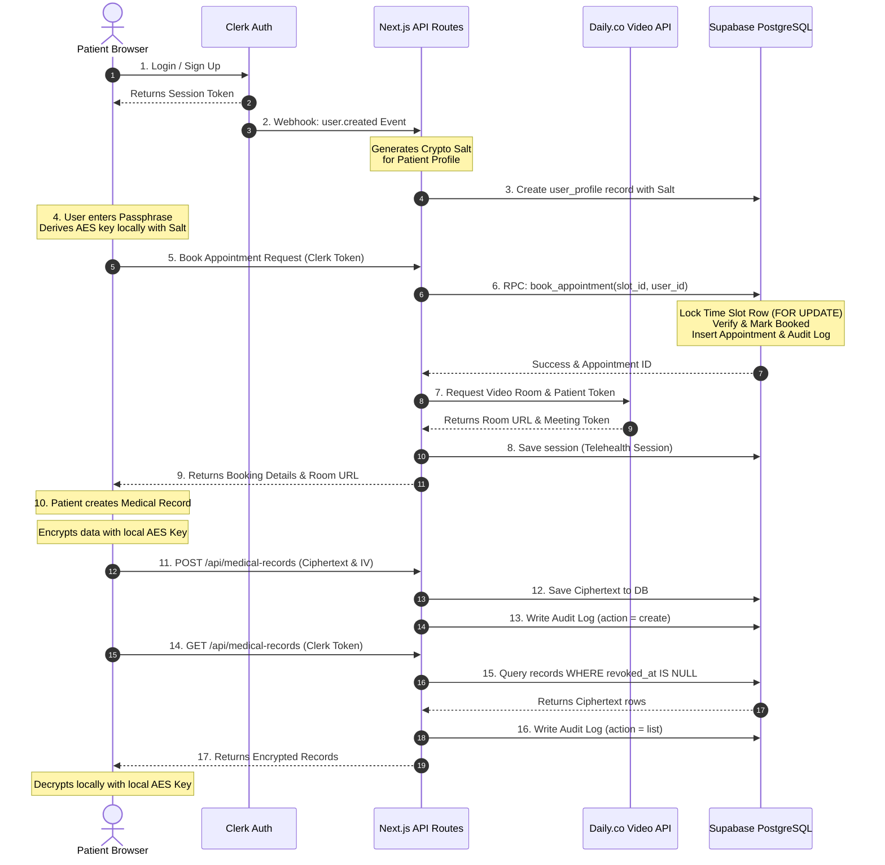

# System Architecture: Smart-Clinic Health Portal 🛡️

This document outlines the architecture, security mechanisms, cryptographic model, database configuration, and data flows of the Smart-Clinic Health Portal.

---

## 🗺️ High-Level System Architecture

The following diagram illustrates the interaction between the patient browser, Clerk (authentication provider), Next.js backend services, Daily.co (video infrastructure), and Supabase (database layer).



---

## 🔑 Cryptographic Security Model (Client-Side E2EE)

To ensure strict patient confidentiality and HIPAA compliance, all sensitive information (medical records and appointment notes) is encrypted **client-side** (in the browser) before storage. 

### 1. Key Derivation (PBKDF2)
When a user inputs their passphrase (which is independent of their login credentials), the portal derives an AES key:
*   **Algorithm:** `PBKDF2` (Password-Based Key Derivation Function 2)
*   **Hash Function:** `SHA-256`
*   **Salt:** A cryptographically secure random value (`16 bytes`), generated during user registration and stored in the user profile as base64.
*   **Iterations:** `100,000` (conforming to OWASP recommendations to protect against brute-force attacks).
*   **Derived Key:** `AES-GCM-256` symmetric key (marked as non-extractable in memory for enhanced security).

Code implementation resides in [encryption.ts](file:///d:/projects/Health_Portal/src/lib/crypto/encryption.ts#L36-L70).

### 2. Encryption/Decryption (AES-GCM)
*   **Cipher:** `AES-GCM` (Advanced Encryption Standard in Galois/Counter Mode).
*   **Initialization Vector (IV):** Generates a unique `12-byte` IV for *every single* encryption operation. This is stored alongside the ciphertext in the database to prevent replay and pattern-matching attacks.
*   **Ciphertext Output:** The final payload saved to the database consists of base64-encoded strings of the IV and the ciphertext.

Code implementation resides in [encryption.ts](file:///d:/projects/Health_Portal/src/lib/crypto/encryption.ts#L72-L116).

### 3. Cryptographic Parameters Life Cycle
*   **Key Derivation Time:** Roughly 10-100ms depending on CPU performance (estimated dynamically via `EncryptionService.estimateKeyDerivationTime`).
*   **Passphrase Hint:** A partial masking service reveals only the last 4 characters of the passphrase for user verification assistance.
*   **Key Rotation:** Supports active key rotation ([encryption.ts](file:///d:/projects/Health_Portal/src/lib/crypto/encryption.ts#L142-L167)) where old data is decrypted with the old key, and re-encrypted with a new key derived from a new passphrase and fresh salt.

---

## 🗄️ Database Architecture & Access Control

The database is built on PostgreSQL with Row Level Security (RLS) enabled on all tables to enforce strict data isolation.

### 1. Row Level Security (RLS) Policies
Each table contains RLS rules that utilize the incoming JSON Web Token (JWT) claims populated by Clerk.

*   `user_profiles`: Users can select and update only their own profile:
    ```sql
    CREATE POLICY "Users can view own profile"
      ON user_profiles FOR SELECT
      USING (clerk_user_id = current_setting('request.jwt.claims', true)::json->>'sub');
    ```
*   `time_slots`: Open slots are public, but booked slots are only visible to the booking patient.
*   `appointments`: Patients can select, insert, or update only records where `patient_id` matches their Clerk sub ID.
*   `medical_records`: Access is restricted to the owning patient, and only if the record has not been revoked (`revoked_at IS NULL`).

### 2. Atomic Appointment Booking (RPC)
To prevent race conditions where multiple patients attempt to book the same slot simultaneously, the transaction is delegated to a PL/pgSQL function `book_appointment` run on the database:
1.  **Row Locking:** It executes a `SELECT ... FOR UPDATE` on the requested `time_slots` row, blocking other parallel sessions from evaluating the booking status.
2.  **State Check:** If `is_booked` is already true, it rolls back and returns an error.
3.  **Atomic Modification:** Updates the slot to `is_booked = true` and inserts a matching record into the `appointments` table.
4.  **Audit Trail Integration:** Inserts an event directly into `audit_logs` inside the same transaction.

Code implementation resides in [schema.sql](file:///d:/projects/Health_Portal/schema.sql#L321-L393).

### 3. Immutable Audit Trails (HIPAA)
Under HIPAA security directives, audit logs must be tamper-proof and immutable. The `audit_logs` table enforces this via PostgreSQL security policies:
*   `INSERT` is allowed globally for logging client/server activities.
*   `UPDATE` and `DELETE` operations are blocked by policies that resolve directly to `USING (false)`.
*   Indexes are placed on `actor_id` and `resource_id` to quickly search access trails during compliance audits.

Code implementation resides in [schema.sql](file:///d:/projects/Health_Portal/schema.sql#L269-L316).

---

## 📡 Integrations

### 1. Clerk Authentication & Sync Webhook
*   Authentication is managed externally by Clerk. Route safety is monitored by Next.js middleware ([middleware.ts](file:///d:/projects/Health_Portal/src/middleware.ts)).
*   A Webhook handler ([route.ts](file:///d:/projects/Health_Portal/src/app/api/webhooks/clerk/route.ts)) intercepts `user.created` events, extracts registration metadata, triggers a local cryptographic salt generation, and registers the profile in Supabase using the high-privilege `supabaseAdmin` client.

### 2. Daily.co Video API
*   Appointments of type `video` trigger a REST call in the backend helper ([helper.ts](file:///d:/projects/Health_Portal/src/utils/helper.ts)) to Daily's REST endpoint `/v1/rooms`.
*   A custom private room is provisioned with screen sharing allowed, chat disabled, knocking enabled (waiting room), cloud recording enabled, and a fixed 1-hour expiration.
*   A secure `meeting-token` is generated to authorize the patient's entry into the private call frame.
